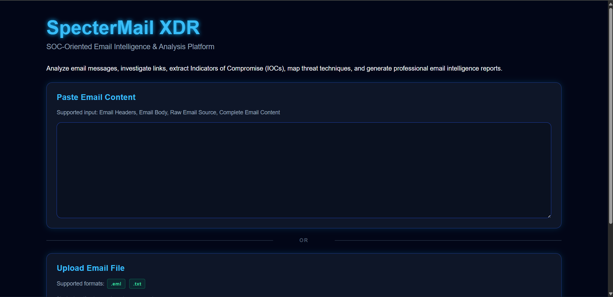
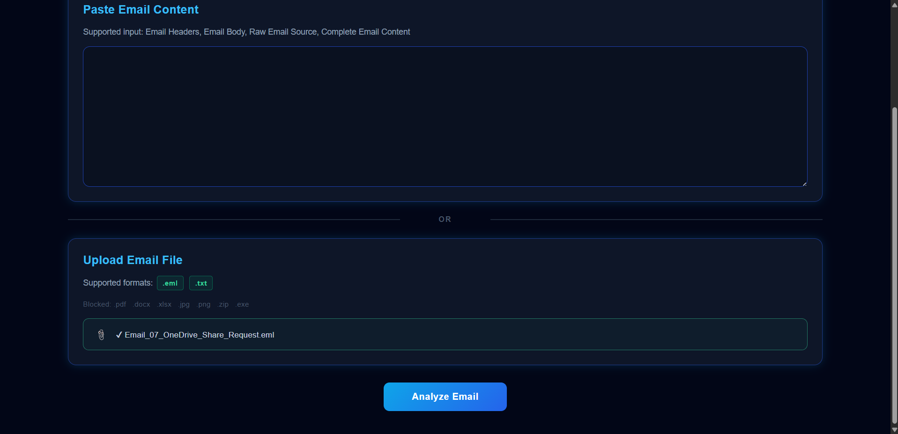
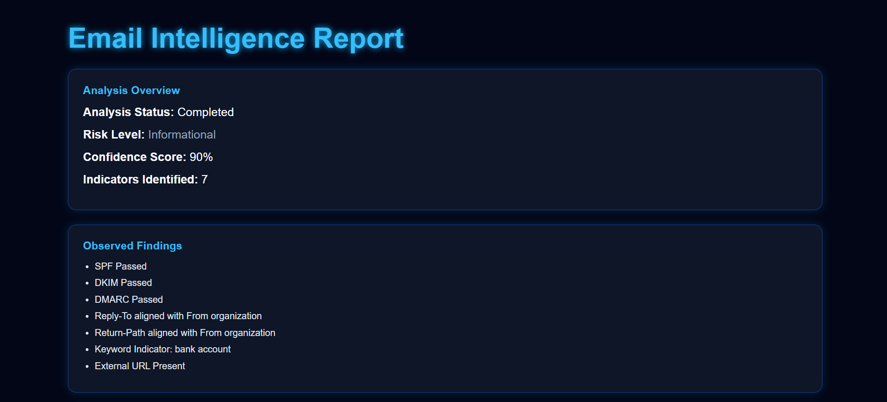
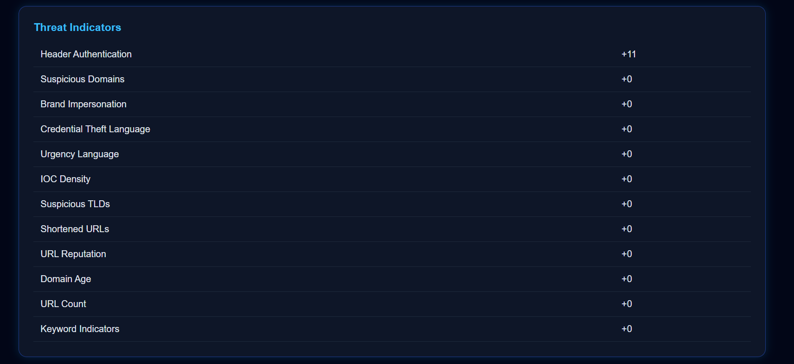
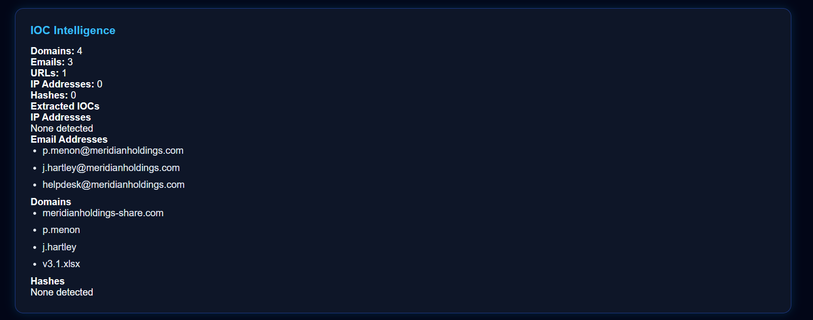
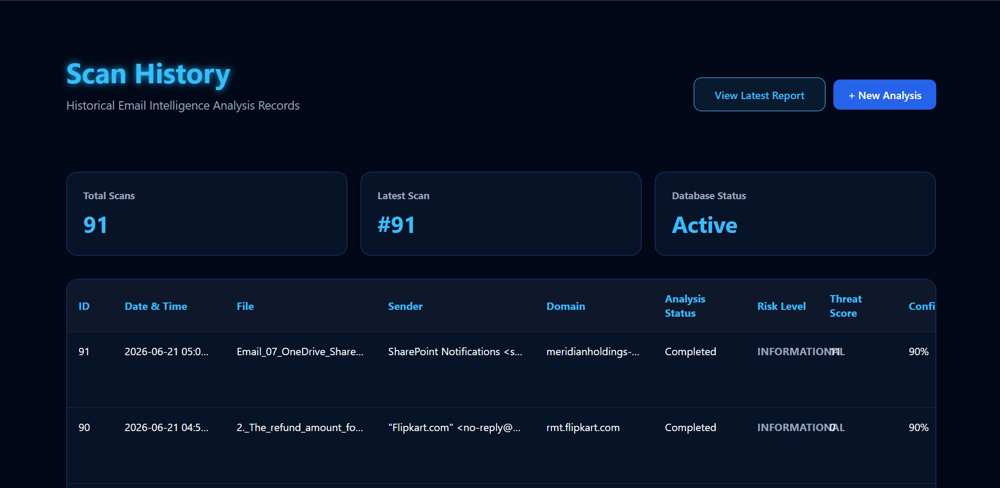

# SpecterMail XDR - Email Intelligence & Analysis Platform

SpecterMail XDR is a Flask-based Email Intelligence & Analysis Platform that helps analyze email content, perform SPF, DKIM, and DMARC checks, extract URLs and domains, gather domain intelligence information, identify Indicators of Compromise (IOCs) and generate investigation reports.

## Features

- EML, TXT, and pasted-content analysis
- URL normalization for `http`, `https`, `hxxp`, `hxxps`, `www`, bare domains, and defanged domains
- IOC extraction for domains, emails, IPv4, IPv6, MD5, SHA1, and SHA256
- Header analysis for SPF, DKIM, DMARC, Reply-To mismatch, Return-Path mismatch, and suspicious sender TLDs
- Multi-layer indicator detection for urgency, credential theft, brand impersonation, suspicious domains, suspicious TLDs, IOC density, and authentication failures
- Risk level, confidence score, PDF report, IOC export, dashboard, and scan history

## Screenshots

### Dashboard

### Email Upload

### Analysis Overview

### Threat Indicators

### IOC Intelligence

### Scan History

## Technology Stack

Python

Flask

SQLAlchemy

ReportLab

dnspython

python-whois

validators

tldextract

## Installation

git clone https://github.com/Theroothex/spectermail-xdr.git
cd spectermail-xdr

python -m venv venv
venv\Scripts\activate

pip install -r requirements.txt

copy .env.example .env

python run.py

Set a strong `SECRET_KEY` in `.env` before using the app outside local development.

## Security Features

Input Validation
File Upload Validation (Supports .txt and .eml files)
Random Secret Key Configuration
Basic Rate Limiting
Secure PDF Report Generation
IOC (Indicators of Compromise) Report Generation
Scan History Tracking
Application Logging

## Scoring

The platform analyzes multiple email indicators and assigns a threat score and risk level based on the findings.

Risk Levels:

Informational
Low
Medium
High
Critical

## Reporting 

The generated report includes:

Risk Level
Confidence Score
Extracted IOCs
SPF Pass/Fail Status
DKIM Pass/Fail Status
DMARC Pass/Fail Status
Domain & URL Intelligence
Analyst Summary

## testing

pytest

The current regression tests cover URL normalization, IOC validation, header spoofing resistance, and score capping.

## Author

Sandeep Mandal

GitHub: https://github.com/Theroothex
